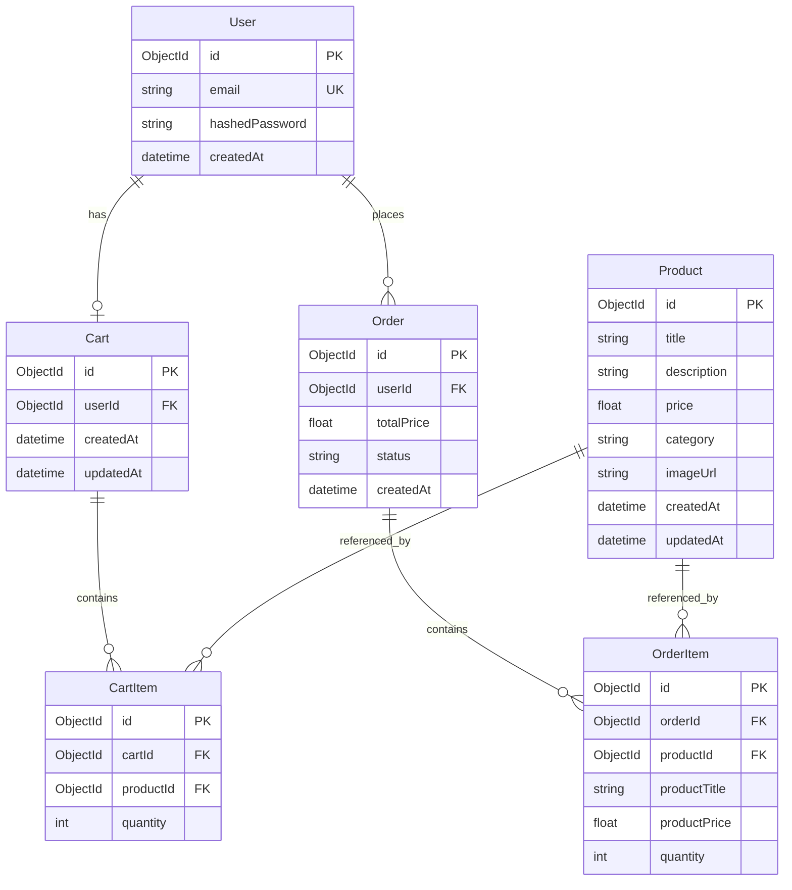

# Design Document

## Overview

The e-commerce backend system will be built using FastAPI with a layered architecture pattern. The system follows clean architecture principles with clear separation between API routes, business logic, data access, and domain models. MongoDB will serve as the primary database with Prisma as the ORM. JWT tokens will handle authentication, and Pydantic schemas will ensure type safety and validation throughout the application.

## Architecture

### Layered Architecture

```
┌─────────────────────────────────────┐
│         API Layer (Routes)          │  ← FastAPI endpoints
├─────────────────────────────────────┤
│       Schemas (Pydantic)            │  ← Request/Response validation
├─────────────────────────────────────┤
│      Services (Business Logic)      │  ← Core business rules
├─────────────────────────────────────┤
│    Repositories (Data Access)       │  ← Database operations
├─────────────────────────────────────┤
│      Models (Prisma)                │  ← Database schema
└─────────────────────────────────────┘
```

### Project Structure

```
src/
├── api/
│   ├── __init__.py
│   ├── deps.py              # Dependency injection
│   └── v1/
│       ├── __init__.py
│       ├── auth.py          # Authentication endpoints
│       ├── products.py      # Product endpoints
│       ├── cart.py          # Cart endpoints
│       └── orders.py        # Order endpoints
├── core/
│   ├── __init__.py
│   ├── config.py            # Settings and configuration
│   ├── security.py          # Password hashing, JWT
│   └── database.py          # Database connection
├── prisma/
│   └── schema.prisma        # Prisma schema definition
├── schemas/
│   ├── __init__.py
│   ├── user.py              # User schemas
│   ├── product.py           # Product schemas
│   ├── cart.py              # Cart schemas
│   ├── order.py             # Order schemas
│   └── token.py             # Token schemas
├── services/
│   ├── __init__.py
│   ├── auth_service.py      # Authentication logic
│   ├── product_service.py   # Product business logic
│   ├── cart_service.py      # Cart business logic
│   └── order_service.py     # Order business logic
├── repositories/
│   ├── __init__.py
│   ├── user_repository.py
│   ├── product_repository.py
│   ├── cart_repository.py
│   └── order_repository.py
├── middlewares/
│   ├── __init__.py
│   └── error_handler.py     # Global error handling
└── utils/
    ├── __init__.py
    └── pagination.py        # Pagination utilities
```

## Components and Interfaces

### 1. Authentication System

**Components:**

- `auth.py` (API routes)
- `auth_service.py` (Business logic)
- `user_repository.py` (Data access)
- `security.py` (Utilities)

**Key Functions:**

```python
# security.py
def hash_password(password: str) -> str
def verify_password(plain_password: str, hashed_password: str) -> bool
def create_access_token(data: dict) -> str
def decode_access_token(token: str) -> dict

# auth_service.py
def register_user(user_data: UserCreate) -> User
def authenticate_user(email: str, password: str) -> User | None
def get_current_user(token: str) -> User
```

**Authentication Flow:**

1. User submits credentials to `/auth/register` or `/auth/login`
2. Service layer validates and processes request
3. For registration: hash password, check duplicates, create user
4. For login: verify credentials, generate JWT token
5. Protected routes use dependency injection to validate JWT and extract user

### 2. Product Management

**Components:**

- `products.py` (API routes)
- `product_service.py` (Business logic)
- `product_repository.py` (Data access)

**Key Functions:**

```python
# product_service.py
def create_product(product_data: ProductCreate) -> Product
def get_products(skip: int, limit: int, search: str, category: str, sort: str) -> List[Product]
def get_product_by_id(product_id: int) -> Product | None
def update_product(product_id: int, product_data: ProductUpdate) -> Product
def delete_product(product_id: int) -> bool
```

**Search/Filter/Sort Implementation:**

- Use Prisma query filters for search (contains for case-insensitive)
- Filter by category using exact match
- Sort using orderBy clause (price asc/desc)
- Pagination using skip and take

### 3. Shopping Cart

**Components:**

- `cart.py` (API routes)
- `cart_service.py` (Business logic)
- `cart_repository.py` (Data access)

**Key Functions:**

```python
# cart_service.py
def add_to_cart(user_id: int, product_id: int, quantity: int) -> CartItem
def remove_from_cart(user_id: int, cart_item_id: int) -> bool
def update_cart_item(user_id: int, cart_item_id: int, quantity: int) -> CartItem
def get_user_cart(user_id: int) -> Cart
def clear_cart(user_id: int) -> bool
```

**Cart Logic:**

- Each user has one cart (one-to-one relationship)
- Cart contains multiple cart items (one-to-many)
- Cart items reference products (many-to-one)
- When adding existing product, update quantity instead of creating duplicate
- Calculate total price dynamically from cart items

### 4. Order Management

**Components:**

- `orders.py` (API routes)
- `order_service.py` (Business logic)
- `order_repository.py` (Data access)

**Key Functions:**

```python
# order_service.py
def create_order(user_id: int) -> Order
def get_user_orders(user_id: int) -> List[Order]
def get_order_by_id(user_id: int, order_id: int) -> Order | None
```

**Order Creation Flow:**

1. Validate user has items in cart
2. Create order record with total price
3. Copy cart items to order items (snapshot)
4. Clear user's cart
5. Return created order

## Data Models

### Prisma Schema Structure

The Prisma schema will define all models with MongoDB as the datasource. Here's the structure:

```prisma
datasource db {
  provider = "mongodb"
  url      = env("DATABASE_URL")
}

generator client {
  provider = "prisma-client-py"
}

model User {
  id              String   @id @default(auto()) @map("_id") @db.ObjectId
  email           String   @unique
  hashedPassword  String
  createdAt       DateTime @default(now())

  cart            Cart?
  orders          Order[]

  @@map("users")
}

model Product {
  id          String   @id @default(auto()) @map("_id") @db.ObjectId
  title       String
  description String
  price       Float
  category    String
  imageUrl    String
  createdAt   DateTime @default(now())
  updatedAt   DateTime @updatedAt

  cartItems   CartItem[]
  orderItems  OrderItem[]

  @@map("products")
}

model Cart {
  id        String   @id @default(auto()) @map("_id") @db.ObjectId
  userId    String   @unique @db.ObjectId
  createdAt DateTime @default(now())
  updatedAt DateTime @updatedAt

  user      User       @relation(fields: [userId], references: [id], onDelete: Cascade)
  items     CartItem[]

  @@map("carts")
}

model CartItem {
  id        String @id @default(auto()) @map("_id") @db.ObjectId
  cartId    String @db.ObjectId
  productId String @db.ObjectId
  quantity  Int

  cart      Cart    @relation(fields: [cartId], references: [id], onDelete: Cascade)
  product   Product @relation(fields: [productId], references: [id])

  @@unique([cartId, productId])
  @@map("cart_items")
}

model Order {
  id         String   @id @default(auto()) @map("_id") @db.ObjectId
  userId     String   @db.ObjectId
  totalPrice Float
  status     String   @default("pending")
  createdAt  DateTime @default(now())

  user       User        @relation(fields: [userId], references: [id])
  items      OrderItem[]

  @@map("orders")
}

model OrderItem {
  id           String @id @default(auto()) @map("_id") @db.ObjectId
  orderId      String @db.ObjectId
  productId    String @db.ObjectId
  productTitle String
  productPrice Float
  quantity     Int

  order        Order   @relation(fields: [orderId], references: [id], onDelete: Cascade)
  product      Product @relation(fields: [productId], references: [id])

  @@map("order_items")
}
```

### Model Descriptions

**User Model:**

- id: MongoDB ObjectId (auto-generated)
- email: Unique identifier for authentication
- hashedPassword: Bcrypt hashed password
- createdAt: Account creation timestamp
- Relationships: One cart, multiple orders

**Product Model:**

- id: MongoDB ObjectId (auto-generated)
- title: Product name
- description: Product details
- price: Product price (Float for MongoDB compatibility)
- category: Product category for filtering
- imageUrl: Product image URL
- createdAt/updatedAt: Timestamps
- Relationships: Referenced by cart items and order items

**Cart Model:**

- id: MongoDB ObjectId (auto-generated)
- userId: Reference to user (one-to-one)
- Timestamps for tracking
- Relationships: Belongs to user, contains multiple cart items

**CartItem Model:**

- id: MongoDB ObjectId (auto-generated)
- cartId: Reference to cart
- productId: Reference to product
- quantity: Number of items
- Unique constraint on (cartId, productId) to prevent duplicates

**Order Model:**

- id: MongoDB ObjectId (auto-generated)
- userId: Reference to user
- totalPrice: Total order amount
- status: Order status (default: "pending")
- createdAt: Order timestamp
- Relationships: Belongs to user, contains multiple order items

**OrderItem Model:**

- id: MongoDB ObjectId (auto-generated)
- orderId: Reference to order
- productId: Reference to product
- productTitle: Snapshot of product title at order time
- productPrice: Snapshot of product price at order time
- quantity: Number of items ordered

### Database Relationships Diagram



## Error Handling

### Exception Hierarchy

```python
class AppException(Exception):
    """Base exception"""
    pass

class NotFoundException(AppException):
    """Resource not found (404)"""
    pass

class UnauthorizedException(AppException):
    """Authentication failed (401)"""
    pass

class ForbiddenException(AppException):
    """Access denied (403)"""
    pass

class ValidationException(AppException):
    """Validation error (422)"""
    pass
```

### Global Error Handler

- Middleware to catch all exceptions
- Map exceptions to appropriate HTTP status codes
- Return consistent error response format:

```json
{
  "detail": "Error message",
  "status_code": 404
}
```

### Validation

- Use Pydantic models for automatic validation
- Custom validators for business rules (e.g., positive prices)
- Prisma schema constraints for data integrity (unique, relations)

## Testing Strategy

### Unit Tests

- Test service layer functions in isolation
- Mock repository layer
- Test business logic edge cases
- Test validation rules

### Integration Tests

- Test API endpoints with test database
- Test authentication flow
- Test database operations
- Test error handling

### Test Structure

```
tests/
├── __init__.py
├── conftest.py              # Fixtures and test setup
├── test_auth.py
├── test_products.py
├── test_cart.py
└── test_orders.py
```

### Key Test Scenarios

1. User registration with duplicate email
2. Login with invalid credentials
3. Access protected endpoint without token
4. Create product with invalid data
5. Add non-existent product to cart
6. Create order with empty cart
7. Update cart item quantity to zero
8. Search and filter products
9. Pagination edge cases

## Security Considerations

1. **Password Security**: Use bcrypt with salt for password hashing
2. **JWT Security**: Set appropriate expiration time, use strong secret key
3. **NoSQL Injection**: Use Prisma ORM parameterized queries
4. **Input Validation**: Validate all inputs with Pydantic
5. **CORS**: Configure CORS middleware for frontend integration
6. **Environment Variables**: Store sensitive config in .env file
7. **Rate Limiting**: (Optional) Implement rate limiting for API endpoints

## Configuration Management

### Settings (core/config.py)

```python
class Settings(BaseSettings):
    # App
    APP_NAME: str
    DEBUG: bool

    # Database
    DATABASE_URL: str

    # Security
    SECRET_KEY: str
    ALGORITHM: str = "HS256"
    ACCESS_TOKEN_EXPIRE_MINUTES: int = 30

    # Pagination
    DEFAULT_PAGE_SIZE: int = 20
    MAX_PAGE_SIZE: int = 100

    class Config:
        env_file = ".env"
```

## API Response Formats

### Success Response

```json
{
  "data": { ... },
  "message": "Success"
}
```

### Paginated Response

```json
{
  "data": [ ... ],
  "total": 100,
  "page": 1,
  "page_size": 20,
  "total_pages": 5
}
```

### Error Response

```json
{
  "detail": "Error message",
  "status_code": 400
}
```

## Performance Considerations

1. **Database Indexing**: MongoDB automatically indexes \_id and unique fields; add indexes for frequently queried fields (category, title)
2. **Eager Loading**: Use Prisma's include to load relationships efficiently
3. **Connection Pooling**: Prisma handles connection pooling automatically
4. **Pagination**: Always paginate list endpoints using skip and take
5. **Caching**: (Optional) Cache product listings with Redis

## Deployment Considerations

1. **Environment Variables**: Use .env for local, environment variables for production
2. **Database Migrations**: Use Prisma migrations (prisma migrate) for schema changes
3. **Prisma Client**: Generate Prisma client with `prisma generate` before deployment
4. **Logging**: Configure structured logging for production
5. **Health Check**: Add /health endpoint for monitoring
6. **Documentation**: Auto-generate API docs with FastAPI's built-in Swagger UI
